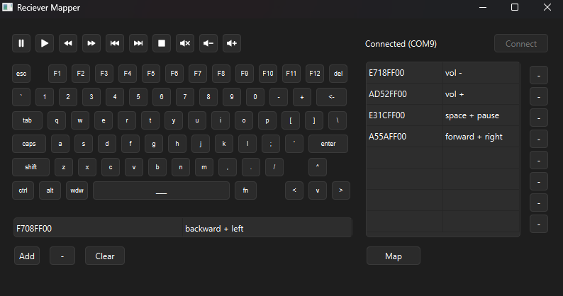

# Universal Receiver

 Maps keyboard keys and media controls to any IR remote with an Arduino receiver. I made it to watch YT on my monitor in bed. 

 ## Hardware

The Arduino acts as a USB keyboard, so once the keys are mapped it will work plug and play with any computer. 

### Components

* Arduino Pro Micro
* KY-022 infrared sensor

### Schematic

TODO: add schematic

### Physical Prototype

Here is my prototype that I use. Made with a perfboard. 

## Software

### Functionality

The software allows you to map any IR signal to a combination of keys and media controls. It automatically connects to the Arduino and supports up to 8 combinations.

### UI

If you have the device plugged into your computer it should automatically connect. Press keys on the on screen keyboard and then push a button on an IR remote. If you want to add this mapping to your device press `Add`. If the remote hex code is already in the mappings, it will replace the old entry. Once you have all the mappings you need, press `Map` to upload them to the device. 

### Setup

To run the software you must have Python installed and the packages `pyqt6` and `pyserial`.