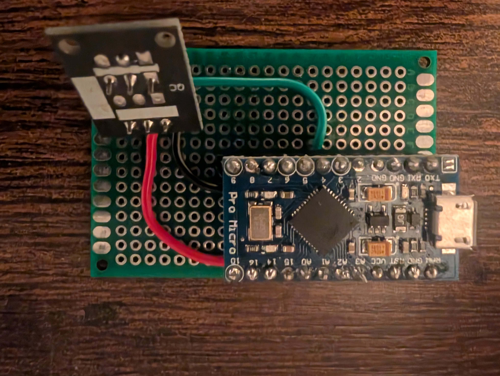

# Universal Receiver

 Maps keyboard keys to any IR remote with an Arduino receiver. I made it to watch YT on my monitor in bed. 

 ## Hardware

The Arduino acts as a USB keyboard, so once the keys are mapped it will work plug and play with any computer. 

### Components

* Arduino Pro Micro
* KY-022 infrared sensor

### Schematic

TODO: add schematic

### Physical Prototype

Here is my prototype that I use. Made with a perfboard. 

